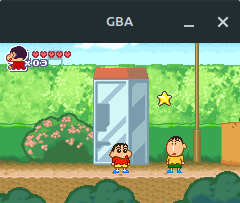
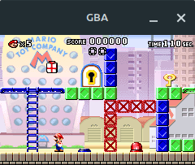
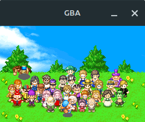
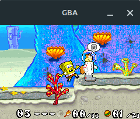

# ArimaGBA – A GameBoy Advance Emulator

**ArimaGBA** is a GameBoy Advance Emulator written in **modern C++**.

## Build

You will need a C++23 compatible compiler like GCC 13, `cmake` version 3.10 or later, `SDL2` and `SDL2_Image`. On a Debian based system these can be installed with these commands:
```bash
sudo apt update
sudo apt install g++ cmake pkg-config libsdl2-2.0-0 libsdl2-dev libsdl2-image-2.0-0 libsdl2-image-dev
```

To build the emulator in release mode, run these:
```bash
mkdir release
cd release
cmake -DCMAKE_BUILD_TYPE=Release ..
make -j$(nproc)
```

This will generate the main executable `arimagba`.

Alternatively, build and run the provided `Dockerfile` which will automatically generate the release binary:
```bash
docker build -t arimagba-builder .
docker run --rm -v .:/app -u $(id -u):$(id -g) arimagba-builder
```

## Running
Run your chosen ROM file easily with:
```bash
./arimagba <rom_file>
```

The following table lists the key bindings used in the emulator:

| Key             | Action                |
|-----------------|-----------------------|
| **X**           | A Button (A)          |
| **Z**           | B Button (B)          |
| **Backspace**   | Select Button (Select)|
| **Enter**       | Start Button (Start)  |
| **Right Arrow** | Right Button (Right)  |
| **Left Arrow**  | Left Button (Left)    |
| **Up Arrow**    | Up Button (Up)        |
| **Down Arrow**  | Down Button (Down)    |
| **S**           | Right Shoulder (R)    |
| **A**           | Left Shoulder (L)     |

## Screenshots

<table>
  <tr>
    <td></td>
    <td></td>
  </tr>
  <tr>
    <td></td>
    <td></td>
  </tr>
</table>

## Features
These GBA features are implemented and working:

* ARM7TDMI Arm & Thumb instructions
* Interrupts
* DMA transfers
* EEPROM game saves
* Graphical modes 0, 3, 4

## Not implemented

The following GBA features are still a work in progress and have not yet been implemented:

* Sound
* Timers
* SRAM & Flash game saves
* Affine sprites
* Graphical modes 1, 2, 5, 6 & 7

## Known bugs

* Several graphical bugs (e.g. sprite priorities)
* Inaccurate multiplication results

## Useful links

### General GBA information

https://www.coranac.com/tonc/text/
https://gbadev.net/tonc/setup.html
https://rust-console.github.io/gbatek-gbaonly/
http://belogic.com/gba/directsound.shtml

### Articles

https://dillonbeliveau.com/2020/06/05/GBA-FLASH.html
https://densinh.github.io/DenSinH/emulation/2021/02/01/gba-eeprom.html

### Test ROMs

* #### CPU

    https://github.com/jsmolka/gba-tests/tree/master
    https://github.com/nba-emu/hw-test/tree/master
    https://github.com/jsmolka/gba-tests/blob/master/memory/memory.gba
    https://github.com/mgba-emu/suite

* #### DMA

    https://github.com/KellanClark/gbastuff/blob/main/dmacnttest/dmacnttest.gba
    https://github.com/PeterLemon/GBA/tree/master

* #### BIOS functions

    https://github.com/PeterLemon/GBA/tree/master/BIOS

* #### OpenBus

    https://github.com/hades-emu/Hades-Tests/tree/master/roms
    https://github.com/fleroviux/openbuster/releases/download/0.1/openbuster.gba
    https://discord.com/channels/465585922579103744/465586361731121162/921932070366883961
    https://discord.com/channels/465585922579103744/465586361731121162/871655745169526844

* #### EEPROM & Flash

    https://github.com/DenSinH/GBARoms/tree/master
